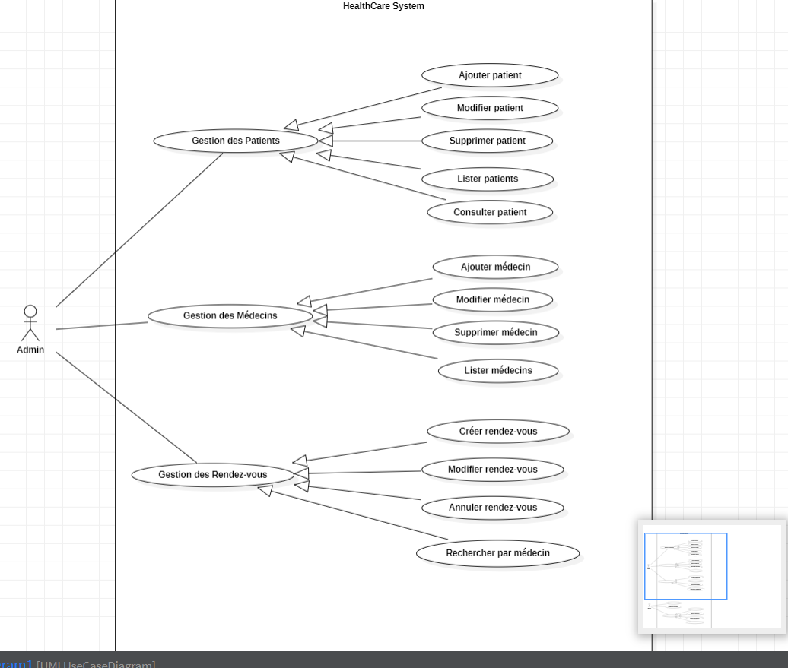

#HealthCare+ : Système de Gestion Médicale

## Description
Le Système de Gestion Médicale est une application web développée avec Spring Boot.

Elle permet de :

# Gestion des Patients
# Gestion des Médecins
# Gestion des Rendez-vous
# Gestion Dossier Médical

## Fonctionnalités
- Créer, modifier, supprimer ,lister et consulter les patients
- Créer, modifier, supprimer et consulter les medecins
- Gérer les dossiers medical pour patient (créé dossier medical, ajouter diagnostic,ajouter observation avec date de création)
- Gérer les rendez-vous entre patients et médecins
- API REST documentée avec Swagger
- creation database avec migration

## Technologies Utilisées
- Java 17 / 21
- Spring Boot
- Spring Data JPA / Hibernate / Flyway
- Maven
- SQL & Jointures
- Derived Queries / @Query (SQL et JPQL)
- Architecture MVC
- REST API
- DTO & Mapper (mapstruct)
- JUnit
- Docker & Dockerfile
- Swagger
- Git & Gitignore

## Structure du projet
src/
├── controller/
├── service/
├── repository/
├── entity/
├── dto/
└── mapper/

##  les trois diagrammes UM

# Diagramme de Classes

# Diagramme de Cas d'Utilisation

# Diagramme de Séquence

- exapmle pour ajouter 

- example pour lister medecins

- example pour supprimer 

- exemple recherche rendez_vous par patient

