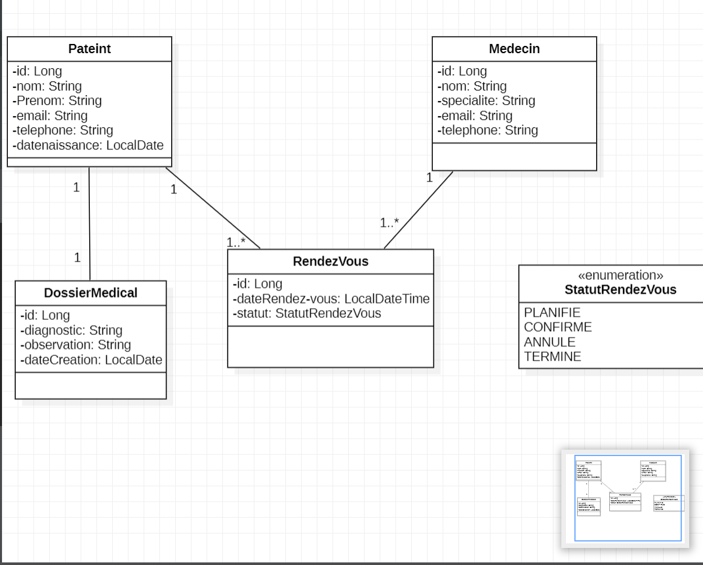
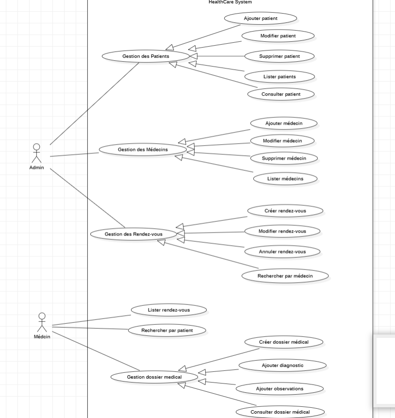
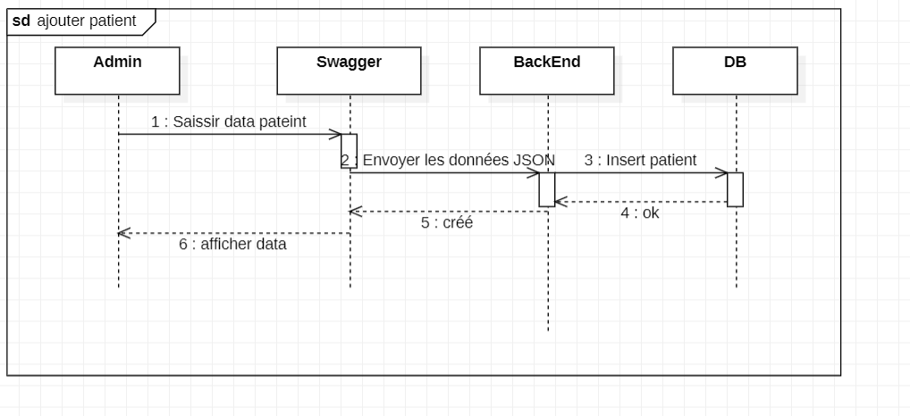
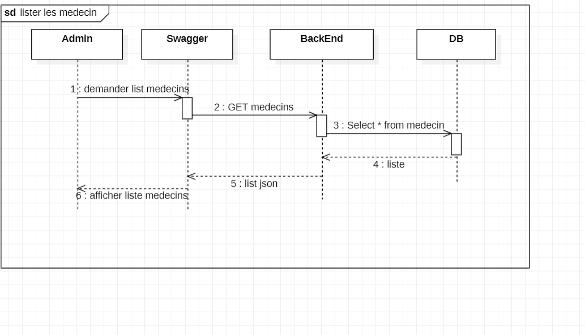
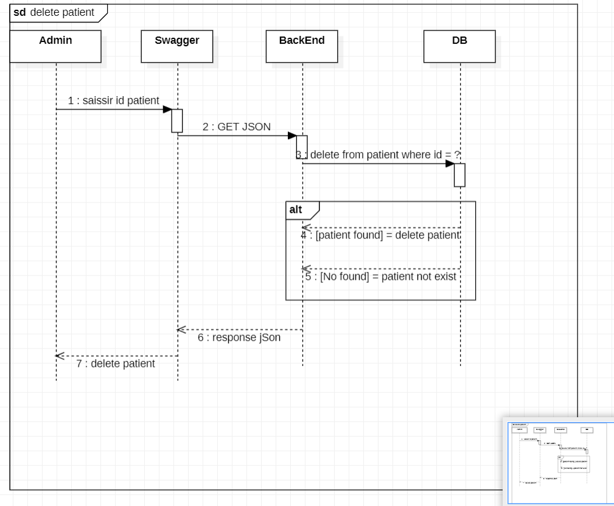
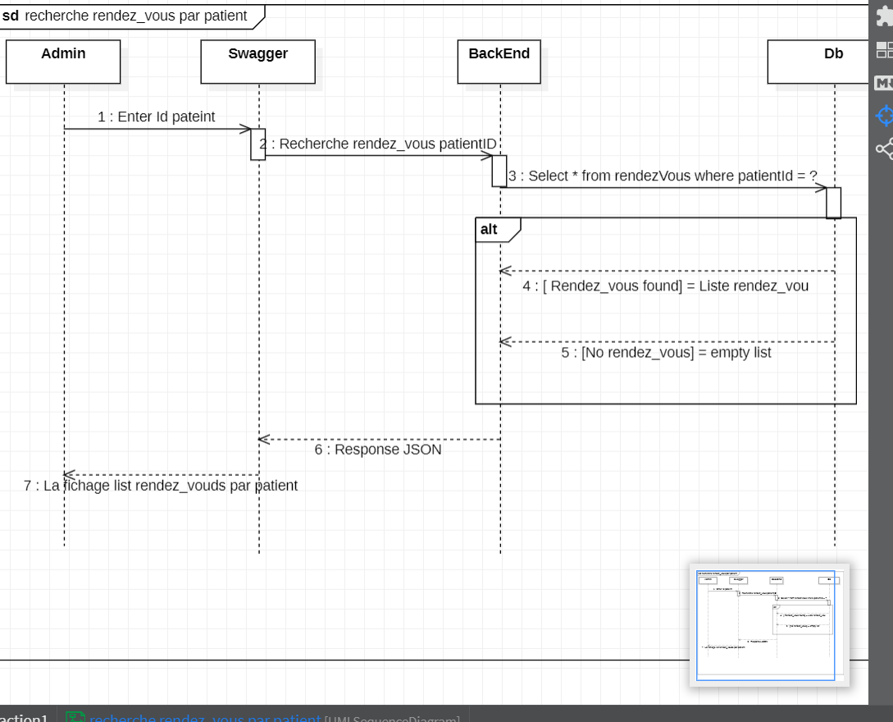

#HealthCare+ : Système de Gestion Médicale

## Description
Le Système de Gestion Médicale est une application web développée avec Spring Boot.

Elle permet de gérer :

- Les patients
- Les médecins
- Les rendez-vous
- Les dossiers medical

## Fonctionnalités

# Gestion des Patients

Ajouter patient
Modifier patient
Supprimer patient
Lister patients
Consulter patient

# Gestion des Médecins

Ajouter médecin
Modifier médecin
Supprimer médecin
Lister médecins

# Gestion des Rendez-vous

Créer rendez-vous
Modifier rendez-vous
Annuler rendez-vous
Lister rendez-vous
Rechercher par patient
Rechercher par médecin

# Gestion Dossier Médical

Créer dossier médical
Ajouter diagnostic
Ajouter observations
Consulter dossier médical

## Technologies Utilisées
- Java 17 / 21
- Spring Boot
- Spring Data JPA / Hibernate / Flyway
- Maven
- SQL & Jointures
- Derived Queries / @Query (SQL et JPQL)
- Architecture MVC
- REST API
- DTO & Mapper (mapstruct)
- JUnit
- Docker & Dockerfile
- Swagger
- Git & Gitignore

## Structure du projet
src/
├── controller/
├── service/
├── repository/
├── entity/
├── dto/
└── mapper/

##  les trois diagrammes UM

# Diagramme de Classes

# Diagramme de Cas d'Utilisation

# Diagramme de Séquence

- exapmle pour ajouter 

- example pour lister medecins

- example pour supprimer 

- exemple recherche rendez_vous par patient

