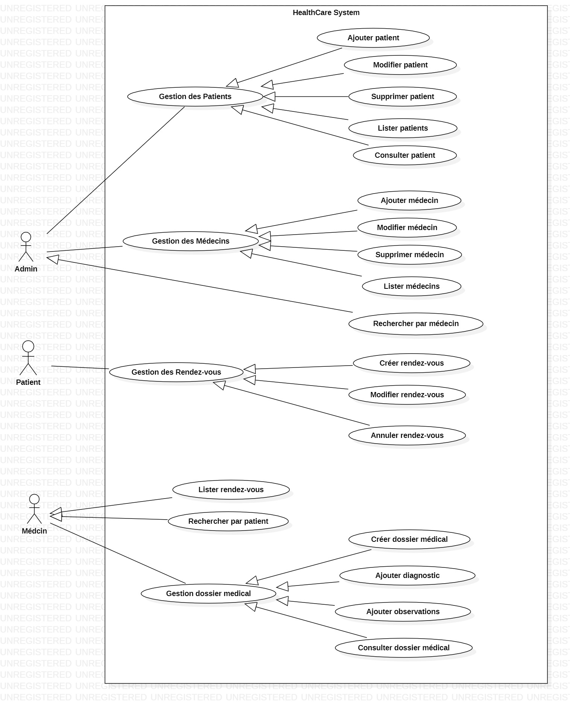

# HealthCare+ : Système de Gestion Médicale

## Description
Le Système de Gestion Médicale est une application web développée avec Spring Boot.

Elle permet de gérer :

- Les patients
- Les médecins
- Les rendez-vous
- Les dossiers medical


## Fonctionnalités

# Gestion des Patients

Ajouter patient
Modifier patient
Supprimer patient
Lister patients
Consulter patient

# Gestion des Médecins

Ajouter médecin
Modifier médecin
Supprimer médecin
Lister médecins

# Gestion des Rendez-vous

Créer rendez-vous
Modifier rendez-vous
Annuler rendez-vous
Lister rendez-vous
Rechercher par patient
Rechercher par médecin

# Gestion Dossier Médical

Créer dossier médical
Ajouter diagnostic
Ajouter observations
Consulter dossier médical


## Technologies Utilisées
- Java 17 / 21
- Spring Boot
- Spring Data JPA / Hibernate / Flyway
- Maven
- SQL & Jointures
- Derived Queries / @Query (SQL et JPQL)
- Architecture MVC
- REST API
- DTO & Mapper (mapstruct)
- JUnit
- Docker & Dockerfile
- Swagger
- Git & Gitignore

## Structure du projet
src/
├── controller/
├── service/
├── repository/
├── entity/
├── dto/
└── mapper/


##  les trois diagrammes UM

# Diagramme de Classes


# Diagramme de Cas d'Utilisation


# Diagramme de Séquence

- exapmle pour ajouter 


- example pour lister medecins


- example pour supprimer 


- exemple recherche rendez_vous par patient


# HealthCare+ : Part 2 - Sécurisation avec Spring Security & JWT

## Description
Dans cette deuxième partie du projet, l'application HealthCare+ a été améliorée avec un système complet d’authentification et de sécurisation des endpoints en utilisant Spring Security et JWT.

L’objectif principal est de protéger l’accès à l’API et permettre uniquement aux utilisateurs authentifiés d’utiliser les fonctionnalités de gestion médicale.

Cette version utilise uniquement l’authentification sans gestion des rôles.

---

## Fonctionnalités Ajoutées

# Authentification Utilisateur

Inscription utilisateur (Register)

Connexion utilisateur (Login)

Génération du token JWT

Validation du token JWT

Gestion de l’expiration JWT

Chiffrement des mots de passe avec BCryptPasswordEncoder

---

# Sécurisation API

Protection des endpoints API

Autoriser uniquement les utilisateurs authentifiés

Accès public aux endpoints :

/auth/register

/auth/login

Filtrage automatique des requêtes via JWT Filter

---

# Gestion Utilisateur

Création de l'entité User :

- id
- username
- email
- password

---

# Validation & Gestion des erreurs

Validation des données utilisateur

Gestion globale des exceptions

Messages d'erreurs personnalisés

---

# Endpoints sécurisés

Les modules suivants nécessitent une authentification :

Patients

Médecins

Rendez-vous

Dossiers médicaux

---

## Concepts Spring Security utilisés

- AuthenticationManager
- PasswordEncoder
- BCryptPasswordEncoder
- UserDetails
- UserDetailsService
- SecurityFilterChain
- JwtFilter
- JwtUtil
- UsernamePasswordAuthenticationToken
- SecurityContextHolder

---

## Flux d'authentification JWT

1. L'utilisateur crée un compte via :

POST /auth/register

2. Le mot de passe est chiffré avec BCrypt avant sauvegarde.

3. L'utilisateur se connecte :

POST /auth/login

4. AuthenticationManager vérifie les informations.

5. Si authentification réussie :

JWT Token généré.

6. Le token est envoyé dans :

Authorization: Bearer Token

7. JWT Filter intercepte chaque requête.

8. Validation du token.

9. Si valide :

Utilisateur authentifié et accès autorisé.

---

## Technologies ajoutées

- Spring Security
- JWT (JSON Web Token)
- BCrypt
- AuthenticationManager
- UserDetailsService
- SecurityFilterChain

---

## Structure ajoutée

src/

├── config/

├── security/

├── filter/

├── service/

├── dto/

├── entity/User.java

├── repository/

└── exception/

---

## Exemple authentification

### Register

POST /auth/register

```json
{
   "username":"admin",
   "email":"admin@gmail.com",
   "password":"123456"
}
```

### Login

POST /auth/login

```json
{
   "username":"admin",
   "password":"123456"
}
```

### Response

```json
{
   "token":"eyJhbGciOiJIUzI1Ni..."
}
```


